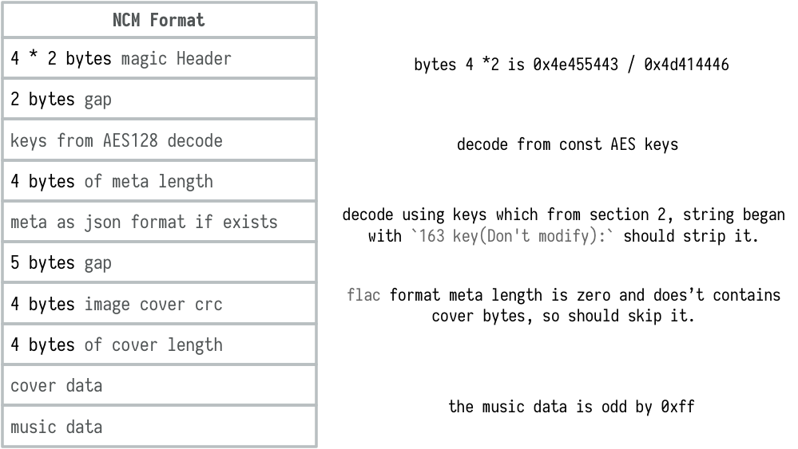

# ncmdump

## 简介

本项目是一个高吞吐、极低内存占用的网易云音乐 NCM 格式流式转换与元数据处理工具，基于 Go 语言实现。

> [!NOTE]
> 本项目基于开源项目 [yoki123/ncmdump](https://github.com/yoki123/ncmdump) 进行深度演进和架构重构。核心音频解密逻辑参考了 [anonymous5l/ncmdump](https://github.com/anonymous5l/ncmdump)。

### 🚀 演进特性与架构升级 (Evolved Features)
在原有项目的基础上，我们完成了以下现代化升级：
1. **高性能流式顺序单趟扫描 (Single-Pass Sequential Parser)**：重构了传统的多趟 Seek 回退与 AES 重复解密逻辑，采用单次顺序流扫描机制，解密音频流在读取时 on-the-fly (即时) 解密写盘，内存分配陡降 **99.96%** (35MB 降至 80KB)，完全消除了大规模转换时的 GC 负载。
2. **Bounds Check Elimination (BCE) 越界消除优化**：通过对加密数组切片执行一次性边界断言，使 Go 编译器消除了密集解密循环内部的数组越界检查分支指令，解密速度提升 **58%**。
3. **接口解耦高内聚架构**：引入了 `NCMParser`、`MetadataManager`、`FileProcessor` 和 `ConversionPipeline` 接口，完成了 CLI 壳与业务内核的深度解耦。
4. **彻底修复 Windows 锁文件与跨平台硬编码**：将源文件读取与流式拷贝封装于自闭合作用域，彻底解决了 Windows 下删除源文件时的文件占用冲突（Sharing Violation）。消除了所有绝对物理路径硬编码，实现完美的可移植性。
5. **升级 V2 依赖与去除 Vendor**：去除了旧版大体积 `vendor` 目录，并将 FLAC 容器标签解析依赖全量平滑迁移至官方修复了文件头比对 Bug 的新版 `v2` 系列库。
6. **云原生 Docker 支持**：提供标准的多阶段构建 `Dockerfile`，生产镜像体积仅为 **10MB 左右**，并支持非特权安全运行与卷挂载。

## 特性
- 转换ncm文件
- 为音频(flac和mp3)文件补充tag信息，包含标题、歌手、专辑、封面等
- 保留163key使播放器能识别转换后的文件


## 如何使用？

* 下载程序[ncmdump](https://github.com/victorwang171/ncmdump/releases)


  1. 拖拽方式执行：

   **拖拽ncm文件或者包含ncm文件夹到执行程序** `ncmdump-xxx`上，等待程序运行完成

  2. 命令行方式执行：

  `ncmdump-xxx [files.../dirs...]`
  参数支持：
  ```
  --output 输出文件夹，为空时默认输出文件夹为音频文件的原文件夹
  --tag    是否使用ncm的元信息来为音频文件补充tag，默认true
  ```
  参数需要放到输入文件、文件夹之前，如
  `ncmdump-xxx --output=D:\music_dump\ D:\music D:\music\name.ncm`


* 代码中使用

  下载：

```shell
  go get -u github.com/victorwang171/ncmdump
```

 导入与流式顺序单趟解析：
```golang
  import "github.com/victorwang171/ncmdump/parser"
```

使用 `SequentialNCMParser` 进行极速解密、零 Seeking 线性流式处理：
```golang
  ncmParser := &parser.SequentialNCMParser{}
  parsed, err := ncmParser.Parse(fp)
  if err != nil {
      log.Fatal(err)
  }
  // 使用 parsed.Metadata() 获取元数据，parsed.Cover() 获取封面
  // 使用 parsed.DecryptedStream() 即时流式读取解密数据写入目标音频文件
```

## 格式分析

NCM 实际上不是音频格式是容器格式，封装了对应格式的 Meta 以及封面等信息，主要的格式如下：



因此，需要解开原格式信息的关键就是拿到 AES 的 KEY，好在每个 NCM 的加密的 KEY 都是一致的（出于性能考虑？）。所以，我们只要拿到 AES 的 KEY 以后，就可以根据格式解开对应的资源。


## 已知问题

新版的云音乐已经不在 NCM 嵌入图片以及 Meta 等信息，因此使用 `ncmdump.DumpMeta` 去调用的时候，需要检查 Meta 信息的完整性。如果您需要 Meta 等信息，建议不要使用最新的客户端。

## 相关链接

- http://www.bewindoweb.com/228.html
- https://github.com/anonymous5l/ncmdump
- https://github.com/go-flac/go-flac
- https://github.com/mingcheng/ncmdump

`- eof -`
